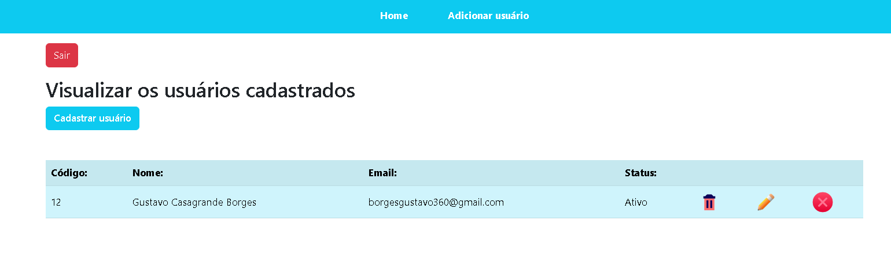

# Sistema Web de Agendas

  

## Índice
* [Introdução](#%EF%B8%8F-introdução)
* [Tecnologias utilizadas](#%EF%B8%8F-tecnologias-utilizadas)
* [Ferramentas utilizadas](#%EF%B8%8F-ferramentas-utilizadas)
* [Serviços utilizados](#-serviços-utilizados)
* [Funcionalidades do projeto](#-funcionalidades-do-projeto)
* [Acesso ao projeto](#-acesso-ao-projeto)
* [Autor](#-autor)
* [Contato](#%EF%B8%8F-contato)

## ⚙️ Introdução

Repositório criado para salvar o sistema construído ao longo do curso de PHP 7 e Mysqli - PHP com Banco de Dados, da Learn In

## 🖥️ Tecnologias utilizadas

- ``PHP``
- ``HTML``
- ``CSS``
- ``Bootstrap``
- ``Laradock``

## 🛠️ Ferramentas utilizadas

- ``Phpstorm``
- ``Docker``

## 🧰 Serviços utilizados

- ``Github``

## 🪚 Funcionalidades do projeto

- ``Funcionalidade 1:`` Visualização dos usuários cadastrados
- ``Funcionalidade 2:`` Login e cadastro no sistema
- ``Funcionalidade 3:`` Edição de usuários cadastrados
- ``Funcionalidade 4:`` Exclusão de usuários cadastrados
- ``Funcionalidade 5:`` Sistema de autenticação para o tipo de perfil

## 📂 Acesso ao projeto

Você pode acessar o projeto através [desse link](https://phpmysqli.devborges.tech/) ou [baixando-o](https://github.com/gustavotht21/curso-php-mysqli/archive/refs/heads/main.zip) e iniciando-o na IDE de sua preferência, onde quando executado irá abrir no navegador o projeto funcionando

OBS: Use as seguintes informações para acessar o sistema como admin e testar as funcionalidades: 
* Email: borges@gmail.com
* Senha: 123

## 👤 Autor

| [ Gustavo Casagrande Borges](https://github.com/gustavotht21) |  
| :---: | 

## ✉️ Contato

Entre em contato via e-mail: borges.gustavo@estudante.ifro.edu.br
